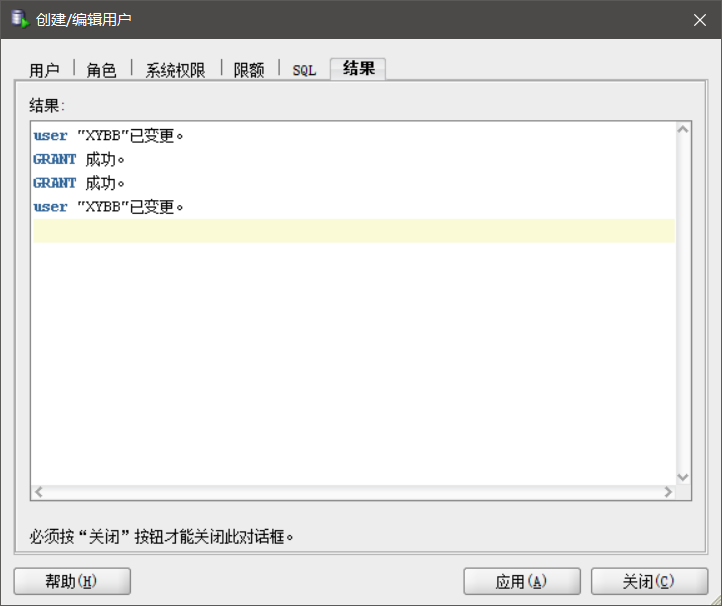
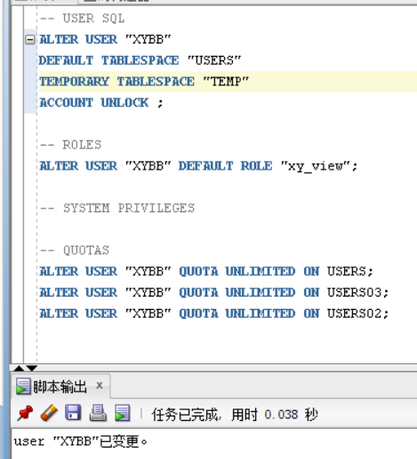
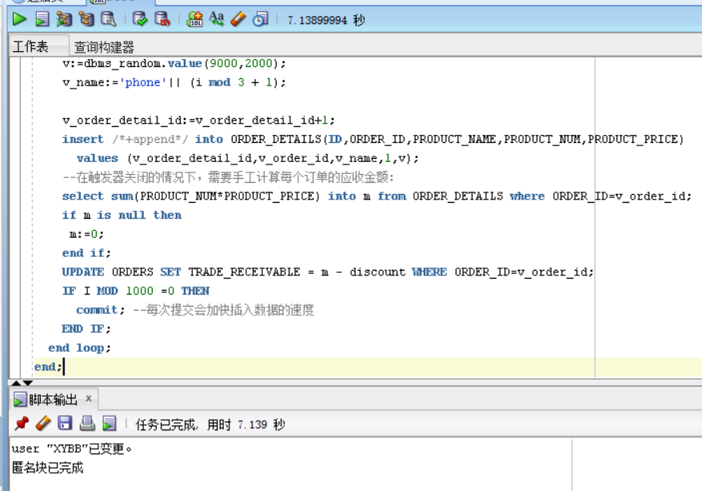
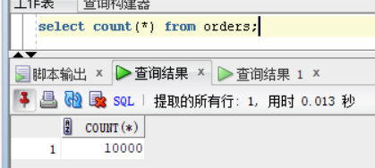

# 谢延 201810414224 软工2班

# 实验三：创建分区表

## 实验目的

**掌握分区表的创建方法，掌握各种分区方式的使用场景。 **

## 实验内容

- 本实验使用3个表空间：USERS,USERS02,USERS03。在表空间中创建两张表：订单表(orders)与订单详表(order_details)。
- 使用**你自己的账号创建本实验的表**，表创建在上述3个分区，自定义分区策略。
- 你需要使用system用户给你自己的账号分配上述分区的使用权限。你需要使用system用户给你的用户分配可以查询执行计划的权限。
- 表创建成功后，插入数据，数据能并平均分布到各个分区。每个表的数据都应该大于1万行，对表进行联合查询。
- 写出插入数据的语句和查询数据的语句，并分析语句的执行计划。
- 进行分区与不分区的对比实验。

## 实验步骤

1.创建分区并授权






2.在主表orders和从表order_details之间建立引用分区。在study用户中创建两个表：orders（订单表）和order_details（订单详表），两个表通过列order_id建立主外键关联。orders表按范围分区进行存储，order_details使用引用分区进行存储。 



3.查询数据

1. 



2. 


由上图所示，两次查询中orders表中的数据有10000行，订单详单order_details表中有30000行。

4.查找orders中日期在2017-1-1到2018-6-1间的数据：


5.ORDER_ID,CUSTOMER_NAME,product_name,product_num,product_price(通过order_id进连表查询)


6.查看数据库使用情况


- autoextensible是显示表空间中的数据文件是否自动增加。
- MAX_MB是指数据文件的最大容量。

## 执行计划分析

#### 有分区sql

```sql
#查看不同分区的数据
set autotrace on
select * from xy.orders where order_date
between to_date('2017-1-1','yyyy-mm-dd') and to_date('2018-6-1','yyyy-mm-dd');
```

[](https://camo.githubusercontent.com/2c04acd48ce4c67b74aed03aa21c954fe26e2cf8bbdf8c387eeeb4dbe781c17b/68747470733a2f2f696d672d626c6f672e6373646e696d672e636e2f32303231303430363232313831363635362e706e673f782d6f73732d70726f636573733d696d6167652f77617465726d61726b2c747970655f5a6d46755a33706f5a57356e6147567064476b2c736861646f775f31302c746578745f6148523063484d364c7939696247396e4c6d4e7a5a473475626d56304c33646c61586870626c38304d7a63794d6a59324e413d3d2c73697a655f31362c636f6c6f725f4646464646462c745f3730)

#### 无分区sql

```sql
set autotrace on
select * from xy.orders_details where order_date
between to_date('2017-1-1','yyyy-mm-dd') and to_date('2018-6-1','yyyy-mm-dd');
```

## 实验总结

​        通过本次实验，我了解并且掌握分区表的创建方法，并且还掌握各种分区方式的使用场景。就数据量来说，根据有分区和无分区sql语句的比较，在orders数据量为10000，order_details数据量为30000时，有分区比无分区查找数据优势会更大。如果数据量大，分区表的优势明显加大。 如果数据量小，有分区与无分区差别不是很大，甚至无分区可能更快。