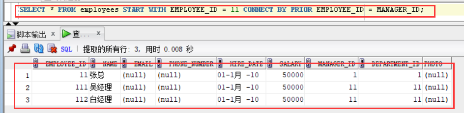

## 姓名：谢延   学号：201810414224   班级：软工2班

## 实验6（期末考核） 基于Oracle的```CRM管理系统```数据库设计 | [返回](./README.md)

## 实验要求：

- 自行设计一个信息系统的数据库项目，自拟```某项目```名称。
- 设计项目涉及的表及表空间使用方案。至少5张表和5万条数据，两个表空间。
- 设计权限及用户分配方案。至少两类角色，两个用户。
- 在数据库中建立一个程序包，在包中用PL/SQL语言设计一些存储过程和函数，实现比较复杂的业务逻辑，用模拟数据进行执行计划分析。
- 设计自动备份方案或则手工备份方案。
- 设计容灾方案。使用两台主机，通过DataGuard实现数据库整体的异地备份。

## 实验场景：

这里是一个CRM管理系统，为一个生产某个产品的单位服务，单位接受网上订单进行产品的销售。通过实验模拟这个单位的部分信息：员工表，部门表，产品表，订单表，订单详单表。

## 实验内容：

## 表设计：

### 表结构：

- 部门表DEPARTMENTS,表空间：USERS

| 编号 | 字段名          | 数据类型          | 可以为空 | 注释           |
| ---- | --------------- | ----------------- | -------- | -------------- |
| 1    | DEPARTMENT_ID   | NUMBER(6,0)       | NO       | 部门ID，主键   |
| 2    | DEPARTMENT_NAME | VARCHAR2(40 BYTE) | NO       | 部门名称，非空 |

- 产品表PRODUCTS,表空间：USERS

| 编号 | 字段名       | 数据类型          | 可以为空 | 注释                               |
| ---- | ------------ | ----------------- | -------- | ---------------------------------- |
| 1    | PRODUCT_NAME | VARCHAR2(40 BYTE) | NO       | 产品名称，产品表的主键             |
| 2    | PRODUCT_TYPE | VARCHAR2(40 BYTE) | NO       | 产品类型，只能取值：耗材,手机,电脑 |

- 员工表EMPLOYEES,表空间：USERS

| 编号 | 字段名        | 数据类型          | 可以为空 | 注释                                                         |
| ---- | ------------- | ----------------- | -------- | ------------------------------------------------------------ |
| 1    | EMPLOYEE_ID   | NUMBER(6,0)       | NO       | 员工ID，员工表的主键。                                       |
| 2    | NAME          | VARCHAR2(40 BYTE) | NO       | 员工姓名，不能为空，创建不唯一B树索引。                      |
| 3    | EMAIL         | VARCHAR2(40 BYTE) | YES      | 电子信箱                                                     |
| 4    | PHONE_NUMBER  | VARCHAR2(40 BYTE) | YES      | 电话                                                         |
| 5    | HIRE_DATE     | DATE              | NO       | 雇佣日期                                                     |
| 6    | SALARY        | NUMBER(8,2)       | YES      | 月薪，必须>0                                                 |
| 7    | MANAGER_ID    | NUMBER(6,0)       | YES      | 员工的上司，是员工表EMPOLYEE_ID的外键，MANAGER_ID不能等于EMPLOYEE_ID,即员工的领导不能是自己。主键删除时MANAGER_ID设置为空值。 |
| 8    | DEPARTMENT_ID | NUMBER(6,0)       | YES      | 员工所在部门，是部门表DEPARTMENTS的外键                      |
| 9    | PHOTO         | BLOB              | YES      | 员工照片                                                     |

- 订单表ORDERS, 表空间：分区表：USERS,USERS02

| 编号 | 字段名           | 数据类型          | 可以为空 | 注释                                                         |
| ---- | ---------------- | ----------------- | -------- | ------------------------------------------------------------ |
| 1    | ORDER_ID         | NUMBER(10,0)      | NO       | 订单编号，主键，值来自于序列：SEQ_ORDER_ID                   |
| 2    | CUSTOMER_NAME    | VARCHAR2(40 BYTE) | NO       | 客户名称，B树索引                                            |
| 3    | CUSTOMER_TEL     | VARCHAR2(40 BYTE) | NO       | 客户电话                                                     |
| 4    | ORDER_DATE       | DATE              | NO       | 订单日期，根据该属性分区存储：2015年及以前的数据存储在USERS表空间，2016年及以后的数据存储在USERS02表空间中。 |
| 5    | EMPLOYEE_ID      | NUMBER(6,0)       | NO       | 订单经手人，员工表EMPLOYEES的外键                            |
| 6    | DISCOUNT         | Number(8,2)       | YES      | 订单整体优惠金额。默认值为0                                  |
| 7    | TRADE_RECEIVABLE | Number(8,2)       | YES      | 订单应收货款，默认为0，Trade_Receivable= sum(订单详单表.Product_Num*订单详单表.Product_Price)- Discount |

- 订单详单表ORDER_DETAILS, 表空间：分区表：USERS,USERS02，分区参照ORDERS表。

| 编号 | 字段名        | 数据类型          | 可以为空 | 注释                                           |
| ---- | ------------- | ----------------- | -------- | ---------------------------------------------- |
| 1    | ID            | NUMBER(10,0)      | NO       | 本表的主键，值来自于序列：SEQ_ORDER_DETAILS_ID |
| 2    | ORDER_ID      | NUMBER(10,0)      | NO       | 所属的订单号，订单表ORDERS的外键               |
| 4    | PRODUCT_NAME  | VARCHAR2(40 BYTE) | NO       | 产品名称, 是产品表PRODUCTS的外键               |
| 5    | PRODUCT_NUM   | NUMBER(8,2)       | NO       | 产品销售数量，必须>0                           |
| 6    | PRODUCT_PRICE | NUMBER(8,2)       | NO       | 产品销售价格                                   |

- 数据关系图如下 


### 录入数据：

要求至少有1万个订单，每个订单至少有4个详单。至少有两个部门，每个部门至少有1个员工，其中只有一个人没有领导，一个领导至少有一个下属，并且它的下属是另一个人的领导（比如A领导B，B领导C）。


### 序列的应用：

插入ORDERS和ORDER_DETAILS 两个表的数据时，主键ORDERS.ORDER_ID, ORDER_DETAILS.ID的值必须通过序列SEQ_ORDER_ID和SEQ_ORDER_ID取得，不能手工输入一个数字。

### 触发器的应用：

维护ORDER_DETAILS的数据时（insert,delete,update）要同步更新ORDERS表订单应收货款ORDERS.Trade_Receivable的值。如下所示：

```mssql
--创建3个触发器
--------------------------------------------------------
--  DDL for Trigger ORDERS_TRIG_ROW_LEVEL
--------------------------------------------------------
CREATE OR REPLACE EDITIONABLE TRIGGER "ORDERS_TRIG_ROW_LEVEL"
BEFORE INSERT OR UPDATE OF DISCOUNT ON "ORDERS"
FOR EACH ROW --行级触发器
declare
  m number(8,2);
BEGIN
  if inserting then
       :new.TRADE_RECEIVABLE := - :new.discount;
  else
      select sum(PRODUCT_NUM*PRODUCT_PRICE) into m from ORDER_DETAILS where ORDER_ID=:old.ORDER_ID;
      if m is null then
        m:=0;
      end if;
      :new.TRADE_RECEIVABLE := m - :new.discount;
  end if;
END;

--批量插入订单数据之前，禁用触发器
ALTER TRIGGER "ORDERS_TRIG_ROW_LEVEL" DISABLE;


--------------------------------------------------------
--  DDL for Trigger ORDER_DETAILS_ROW_TRIG
--------------------------------------------------------

CREATE OR REPLACE EDITIONABLE TRIGGER "ORDER_DETAILS_ROW_TRIG"
AFTER DELETE OR INSERT OR UPDATE  ON ORDER_DETAILS
FOR EACH ROW
BEGIN
  --DBMS_OUTPUT.PUT_LINE(:NEW.ORDER_ID);
  IF :NEW.ORDER_ID IS NOT NULL THEN
    MERGE INTO ORDER_ID_TEMP A
    USING (SELECT 1 FROM DUAL) B
    ON (A.ORDER_ID=:NEW.ORDER_ID)
    WHEN NOT MATCHED THEN
      INSERT (ORDER_ID) VALUES(:NEW.ORDER_ID);
  END IF;
  IF :OLD.ORDER_ID IS NOT NULL THEN
    MERGE INTO ORDER_ID_TEMP A
    USING (SELECT 1 FROM DUAL) B
    ON (A.ORDER_ID=:OLD.ORDER_ID)
    WHEN NOT MATCHED THEN
      INSERT (ORDER_ID) VALUES(:OLD.ORDER_ID);
  END IF;
END;

ALTER TRIGGER "ORDER_DETAILS_ROW_TRIG" DISABLE;
--------------------------------------------------------
--  DDL for Trigger ORDER_DETAILS_SNTNS_TRIG
--------------------------------------------------------

  CREATE OR REPLACE EDITIONABLE TRIGGER "ORDER_DETAILS_SNTNS_TRIG"
AFTER DELETE OR INSERT OR UPDATE ON ORDER_DETAILS
declare
  m number(8,2);
BEGIN
  FOR R IN (SELECT ORDER_ID FROM ORDER_ID_TEMP)
  LOOP
    --DBMS_OUTPUT.PUT_LINE(R.ORDER_ID);
    select sum(PRODUCT_NUM*PRODUCT_PRICE) into m from ORDER_DETAILS
      where ORDER_ID=R.ORDER_ID;
    if m is null then
      m:=0;
    end if;
    UPDATE ORDERS SET TRADE_RECEIVABLE = m - discount
      WHERE ORDER_ID=R.ORDER_ID;
  END LOOP;
  --delete from ORDER_ID_TEMP; --这句话很重要，否则可能一直不释放空间，后继插入会非常慢。
END;
```

### 查询数据：

1.查询某个员工的信息

```sql
/*查询员工ID为1的员工信息*/
SELECT * FROM employees where employee_id = 1;

```


2.递归查询某个员工及其所有下属，子下属员工。

```sql
SELECT * FROM employees START WITH EMPLOYEE_ID = 11 CONNECT BY PRIOR EMPLOYEE_ID = MANAGER_ID;
```



3.查询订单表，并且包括订单的订单应收货款: Trade_Receivable= sum(订单详单表.ProductNum*订单详单表.ProductPrice)- Discount。

```sql
SELECT
	ORDERS.ORDER_ID, sum(ORDER_DETAILS.PRODUCT_NUM*ORDER_DETAILS.PRODUCT_PRICE-ORDERS.DISCOUNT) 订单应收货款
FROM
	ORDERS,ORDER_DETAILS
WHERE 
	ORDERS.ORDER_ID=ORDER_DETAILS.ORDER_ID
GROUP BY
	ORDERS.ORDER_ID
order by 订单应收货款;
```


4.查询订单详表，要求显示订单的客户名称和客户电话，产品类型用汉字描述。

```sql
SELECT
	CUSTOMER_NAME,CUSTOMER_TEL,PRODUCTS.PRODUCT_NAME
FROM
	ORDERS,ORDER_DETAILS,PRODUCTS
WHERE 
	ORDERS.ORDER_ID=ORDER_DETAILS.ORDER_ID 
	AND
	ORDER_DETAILS.PRODUCT_NAME=PRODUCTS.PRODUCT_NAME
order by CUSTOMER_NAME;
```


5.查询出所有空订单，即没有订单详单的订单。

```sql
SELECT *  FROM ORDERS
WHERE ORDER_ID 
not in (SELECT ORDER_ID FROM ORDER_DETAILS);
```


6.查询部门表，同时显示部门的负责人姓名。

```sql
SELECT DEPARTMENT_NAME,e.NAME 
FROM DEPARTMENTS d,EMPLOYEES e
WHERE d.DEPARTMENT_ID=e.DEPARTMENT_ID;
```


7.查询部门表，统计每个部门的销售总金额。

```sql
SELECT
	DEPARTMENTS.DEPARTMENT_NAME, sum(ORDER_DETAILS.PRODUCT_NUM*ORDER_DETAILS.PRODUCT_PRICE-ORDERS.DISCOUNT) 销售总金额
FROM
	DEPARTMENTS,EMPLOYEES,ORDERS,ORDER_DETAILS
WHERE
	DEPARTMENTS.DEPARTMENT_ID=EMPLOYEES.DEPARTMENT_ID
	AND
	EMPLOYEES.EMPLOYEE_ID=ORDERS.EMPLOYEE_ID
	AND
	ORDERS.ORDER_ID=ORDER_DETAILS.ORDER_ID 
GROUP BY
	DEPARTMENTS.DEPARTMENT_NAME;	
```


## 用户管理：

1.创建分区并授权


2.在主表orders和从表order_details之间建立引用分区。在study用户中创建两个表：orders（订单表）和order_details（订单详表），两个表通过列order_id建立主外键关联。orders表按范围分区进行存储，order_details使用引用分区进行存储。 


3.查询数据

1. 


2. 


由上图所示，两次查询中orders表中的数据有10000行，订单详单order_details表中有30000行。

4.查找orders中日期在2017-1-1到2018-6-1间的数据：


5.ORDER_ID,CUSTOMER_NAME,product_name,product_num,product_price(通过order_id进连表查询)


6.查看数据库使用情况


- autoextensible是显示表空间中的数据文件是否自动增加。
- MAX_MB是指数据文件的最大容量。

### 执行计划分析

#### 有分区sql

```sql
#查看不同分区的数据
set autotrace on
select * from xy.orders where order_date
between to_date('2017-1-1','yyyy-mm-dd') and to_date('2018-6-1','yyyy-mm-dd');
```

[](https://camo.githubusercontent.com/2c04acd48ce4c67b74aed03aa21c954fe26e2cf8bbdf8c387eeeb4dbe781c17b/68747470733a2f2f696d672d626c6f672e6373646e696d672e636e2f32303231303430363232313831363635362e706e673f782d6f73732d70726f636573733d696d6167652f77617465726d61726b2c747970655f5a6d46755a33706f5a57356e6147567064476b2c736861646f775f31302c746578745f6148523063484d364c7939696247396e4c6d4e7a5a473475626d56304c33646c61586870626c38304d7a63794d6a59324e413d3d2c73697a655f31362c636f6c6f725f4646464646462c745f3730)

#### 无分区sql

```sql
set autotrace on
select * from xy.orders_details where order_date
between to_date('2017-1-1','yyyy-mm-dd') and to_date('2018-6-1','yyyy-mm-dd');
```


## PL/SQL设计：

1. 创建一个包(Package)，包名是MyPack。

   ```sql
   create or replace PACKAGE MyPack IS
     FUNCTION Get_SaleAmount(V_DEPARTMENT_ID NUMBER) RETURN NUMBER;
     PROCEDURE Get_Employees(V_EMPLOYEE_ID NUMBER);
   END MyPack;
   ```

   

   ```sql
   create or replace PACKAGE BODY MyPack IS
     FUNCTION Get_SaleAmount(V_DEPARTMENT_ID NUMBER) RETURN NUMBER
    AS
       N NUMBER(20,2); --注意，订单ORDERS.TRADE_RECEIVABLE的类型是NUMBER(8,2),汇总之后，数据要大得多。
    BEGIN
         SELECT SUM(O.TRADE_RECEIVABLE) into N  FROM ORDERS O,EMPLOYEES E
         WHERE O.EMPLOYEE_ID=E.EMPLOYEE_ID AND E.DEPARTMENT_ID =V_DEPARTMENT_ID;
         RETURN N;
       END;
   
     PROCEDURE GET_EMPLOYEES(V_EMPLOYEE_ID NUMBER)
     AS
       LEFTSPACE VARCHAR(2000);
       begin
         --通过LEVEL判断递归的级别
         LEFTSPACE:=' ';
         --使用游标
         for v in
         (SELECT LEVEL,EMPLOYEE_ID,NAME,MANAGER_ID FROM employees
         START WITH EMPLOYEE_ID = V_EMPLOYEE_ID
         CONNECT BY PRIOR EMPLOYEE_ID = MANAGER_ID)
         LOOP
          DBMS_OUTPUT.PUT_LINE(LPAD(LEFTSPACE,(V.LEVEL-1)*4,' ')||
                                V.EMPLOYEE_ID||' '||v.NAME);
         END LOOP;
       END;
   END MyPack;
   ```

   

   

<br>

2. 在MyPack中创建一个函数SaleAmount ，查询部门表，统计每个部门的销售总金额，每个部门的销售额是由该部门的员工(ORDERS.EMPLOYEE_ID)完成的销售额之和。函数SaleAmount要求输入的参数是部门号，输出部门的销售金额。

   ```sql
   --函数Get_SaleAmount()测试方法：
   select MyPack.Get_SaleAmount(11) 部门11应收金额,MyPack.Get_SaleAmount(12) 部门12应收金额 from dual;
   ```


<br>

3. 在MyPack中创建一个过程，在过程中使用游标，递归查询某个员工及其所有下属，子下属员工。过程的输入参数是员工号，输出员工的ID,姓名，销售总金额。信息用dbms_output包中的put或者put_line函数。输出的员工信息用左添加空格的多少表示员工的层次（LEVEL）。比如下面显示5个员工的信息：

   ```sql
   --过程Get_Employees()测试代码：
   set serveroutput on
   DECLARE
     V_EMPLOYEE_ID NUMBER;    
   BEGIN
     V_EMPLOYEE_ID := 1;
     MYPACK.Get_Employees (  V_EMPLOYEE_ID => V_EMPLOYEE_ID) ;  
     V_EMPLOYEE_ID := 11;
     MYPACK.Get_Employees (  V_EMPLOYEE_ID => V_EMPLOYEE_ID) ;    
   END;
   ```

   
   <br>

4. 由于订单只是按日期分区的，上述统计是全表搜索，因此统计速度会比较慢，如何提高统计的速度呢？

   答：在订单表中创建一个关于日期字段的索引。

   
   <br> 

5. 

   ```sql
    ID 姓名 销售总金额
    =======================
    2  张三  5000元
    3 李四   6000元
    4 王五   1000元
        5 孙强  2000元
    6  赵强东 5000 元
   ```

上述输出结果表示 2，6号两个员工是一个级别的，没有领导，3，4号员工的领导是2号，5号员工的领导是4号。 Oracle递归查询的语句格式是：

```sql
SELECT LEVEL,EMPLOYEE_ID,NAME,MANAGER_ID FROM employees 
START WITH EMPLOYEE_ID = EMPLOYEE_ID 
CONNECT BY PRIOR EMPLOYEE_ID = MANAGER_ID
```


## 备份方案设计：

Oracle的备份与恢复有三种标准的模式，大致分为两 大类，备份恢复(物理上的)以及导入导出(逻辑上的)，而备份恢复又可以根据数据库的工作模式分为非归档模式(Nonarchivelog-style) 和归档模式(Archivelog-style),通常，我们把非归档模式称为冷备份，而相应的把归档模式称为热备份，他们的关系如下所示


　　三种方式各有优点，我们做个比较(这个是用Fireworks画的，有点糙)：


热备份和冷备份优缺点

热备份的优点是：
 1．可在表空间或数据文件级备份，备份时间短。
 2．备份时数据库仍可使用。
 3．可达到秒级恢复（恢复到某一时间点上）。
 4．可对几乎所有数据库实体作恢复。
 5．恢复是快速的，在大多数情况下在数据库仍工作时恢复。
热备份的不足是：
 1．不能出错，否则后果严重。
 2．若热备份不成功，所得结果不可用于时间点的恢复。
 3．因难维护，所以要特别仔细小心，不允许“以失败而告终”。
冷备份的优点是：
 1．是非常快速的备份方法（只需拷贝文件）
 2．容易归档（简单拷贝即可）
 3．容易恢复到某个时间点上（只需将文件再拷贝回去）
 4．能与归档方法相结合，作数据库“最新状态”的恢复。
 5．低度维护，高度安全。
冷备份不足是：
 1．单独使用时，只能提供到“某一时间点上”的恢复。
 2．在实施备份的全过程中，数据库必须要作备份而不能作其它工作。也就是说，数据库必须是关闭状态。
 3．若磁盘空间有限，只能拷贝到磁带等其它外部存储设备上，速度会很慢。
 4．不能按表或按用户恢复。

$A:  现在先来介绍一下逻辑备份方式的方法，利用Export可将数据从数据库中提取出来，利用Import则可将提取出来的数据送回到Oracle数据库中 去。理论基础：Oracle提供的Export和Import具有三种不同的操作方式(就是备份的数据输出(入)类型)：

​    1，表方式(T)  可以将指定的表导出备份；

​    2，全库方式(Full)  将数据库中的所有对象导出；

​    3，用户方式(U)   可以将指定的用户相应的所有数据对象导出；

  *在导入导出备份方式中，提供了很强大的一种方法，就是增量导出/导入，但是它必须作为System来完成增量的导入导出，而且只能是对整个数据库进行实施。增量导出又可以分为三种类别：

​    1，完全增量导出(Complete Export)   这种方式将把整个数据库文件导出备份；exp system/manager inctype=complete file=20041125.dmp（为了方便检索和事后的查询，通常我们将备份文件以日期或者其他有明确含义的字符命名）

​    2，增量型增量导出(Incremental Export)   这种方式将只会备份上一次备份后改变的结果；exp system/manager inctype=incremental file=20041125.dmp

​    3，累积型增量导出(Cumulate Export)   这种方式的话，是导出自上次完全增量导出后数据库变化的信息。exp system/manager inctype=cumulative file=20041125.dmp

 通常情况下，DBA们所要做的，就是按照企业指定或者是自己习惯的标准(如果是自己指定的标准，建议写好计划说明)，一般，我们采用普遍认可的下面的方式进行每天的增量备份：

​    Mon： 完全备份（A）
​    Tue： 增量导出（B）
​    Wed：增量导出（C）
​    Thu： 增量导出（D）
​    Fri：  累计导出（E）
​    Sat： 增量导出（F）
​    Sun： 增量导出（G）

这样，我们可以保证每周数据的完整性，以及恢复时的快捷和最大限度的数据损失。恢复的时候，假设事故发生在周末，DBA可按这样的步骤来恢复数据库：
    第一步：用命令CREATE DATABASE重新生成数据库结构；
    第二步：创建一个足够大的附加回滚。
    第三步：完全增量导入A：
          imp system/manager inctype=RESTORE FULL=y FILE=A
    第四步：累计增量导入E：
          imp system/manager inctype=RESTORE FULL=Y FILE=E
    第五步：最近增量导入F：
          imp system/manager inctype=RESTORE FULL=Y FILE=F

　　通常情况下，DBA所要做的导入导出备份就算完成，只要科学的按照规律作出备份，就可以将数据的损失降低到最小，提供更可靠的服务。另外，DBA最好对每次的备份做一个比较详细的说明文档，使得数据库的恢复更加可靠。

$B 物理备份之冷备份(条件－NonArchiveLog)：

   当数据库可以暂时处于关闭状态时，我们需要将它在这一稳定时刻的数据相关文件转移到安全的区域，当数据库遭到破坏，再从安全区域将备份的数据库相关文件拷 贝回原来的位置，这样，就完成了一次快捷安全等数据转移。由于是在数据库不提供服务的关闭状态，所以称为冷备份。冷备份具有很多优良特性，比如上面图中我 们提到的，快速，方便，以及高效。一次完整的冷备份步骤应该是：

   1，首先关闭数据库（shutdown normal）

   2，拷贝相关文件到安全区域（利用操作系统命令拷贝数据库的所有的数据文件、日志文件、控制文件、参数文件、口令文件等（包括路径））

   3，重新启动数据库（startup）

   以上的步骤我们可以用一个脚本来完成操作：

```
   su – oracle <   sqlplus /nolog
   connect / as sysdba
   shutdown immediate;
   !cp 文件  备份位置（所有的日志、数据、控制及参数文件）;
   startup;
   exit;
```

   这样，我们就完成了一次冷备份，请确定你对这些相应的目录（包括写入的目标文件夹）有相应的权限。

   恢复的时候，相对比较简单了，我们停掉数据库，将文件拷贝回相应位置，重启数据库就可以了，当然也可以用脚本来完成。

$C 物理备份之热备份：(条件－ArchiveLog)

   当我们需要做一个精度比较高的备份，而且我们的数据库不可能停掉（少许访问量）时，这个情况下，我们就需要归档方式下的备份，就是下面讨论的热备份。热备 份可以非常精确的备份表空间级和用户级的数据，由于它是根据归档日志的时间轴来备份恢复的，理论上可以恢复到前一个操作，甚至就是前一秒的操作。具体步骤 如下：

   1，通过视图v$database,查看数据库是否在Archive模式下:    

```
SQL> select log_mode from v$database;
```

​       如果不是Archive模式

​       则设定数据库运行于归档模式下：

```
SQL>shutdown immediate
SQL>startup mount
SQL> alter database archivelog;
SQL> alter database open;
```

如果Automaticarchival显示为“Enabled”，则数据库归档方式为自动归档。否则需要手工归档，或者将归档方式修改为自动归档，如：
           正常shutdown数据库，在参数文件中init.ora中加入如下参数

```
SQL>shutdown immediate
```

​       修改init.ora：
​        LOG_ARCHIVE_START=TRUE
​        LOG_ARCHIVE_DEST1=ORACLE_HOME/admin/o816/arch(归档日值存放位置可以自己定义)
​        SQL>startup
　然后，重新启动数据库，此时Oracle数据库将以自动归档的方式工作在Archive模式下。其中参数LOG_ARCHIVE_DEST1是指定的归 档日志文件的路径，建议与Oracle数据库文件存在不同的硬盘，一方面减少磁盘I/O竞争，另外一方面也可以避免数据库文件所在硬盘毁坏之后的文件丢 失。归档路径也可以直接指定为磁带等其它物理存储设备，但可能要考虑读写速度、可写条件和性能等因素。   

**注意**： 当数据库处在ARCHIVE模式下时，一定要保证指定的归档路径可写，否则数据库就会挂起，直到能够归档所有归档信息后才可以使用。另外，为创建一个有效 的备份,当数据库在创建时,必须履行一个全数据库的冷备份,就是说数据库需要运行在归档方式,然后正常关闭数据库,备份所有的数据库组成文件。这一备份是 整个备份的基础,因为该备份提供了一个所有数据库文件的拷贝。（体现了冷备份与热备份的合作关系，以及强大的能力）

2，备份表空间文件：

​         a,首先，修改表空间文件为备份模式 

```sql
ALTER TABLESPACE tablespace_name BEGIN BACKUP;
```

​         b,然后，拷贝表空间文件到安全区域 

```
!CP tablespace_name D_PATH;
```

​         c,最后，将表空间的备份模式关闭  

```sql
ALTER TABLESPACE tablespace_name END BACKUP;
```

​      3，对归档日志文件的备份：

​         停止归档进程－－>备份归档日志文件－－>启动归档进程

　　如果日志文档比较多，我们将它们写入一个文件成为一个恢复的参考：

```
$  files `ls <归档文件路径>/arch*.dbf`;export files
```

​      4，备份控制文件:

```
SQL> alter database backup controlfile to 'controlfile_back_name（一般用2004-11-20的方式）' reuse;
```

​      当然，我们也可以将上面的东东写为一个脚本，在需要的时候执行就可以了:

​       脚本范例：

```
 su – oracle <   sqlplus /nolog
connect / as sysdba
ALTER TABLESPACE tablespace_name BEGIN BACKUP

 !CP tablespace_name D_PATH

ALTER TABLESPACE tablespace_name END BACKUP

alter database backup controlfile to 'controlfile_back_name（一般用2004-11-20的方式）' reuse;

!files `ls <归档文件路径>/arch*.dbf`;export files
```

热备份的恢复，对于归档方式数据库的恢复要求不但有有效的日志备份还要求有一个在归档方式下作的有效的全库备份。归档备份在理论上可以无数据丢失，但 是对于硬件以及操作人员的要求都比较高。在我们使用归档方式备份的时候，全库物理备份也是非常重要的。归档方式下数据库的恢复要求从全备份到失败点所有的 日志都要完好无缺。
        恢复步骤：LOG_ARCHIVE_DEST_1
                shutdown数据库。
                将全备份的数据文件放到原来系统的目录中。
                将全备份到失败点的所有归档日志放到参数LOG_ARCHIVE_DEST_1所指定的位置。
                利用sqlplus登陆到空实例。（connect / as sysdba）
                然后 startup mount
                    set autorecovery on
                    recover database;
                    alter database open;

## 容灾方案设计：

1. 恢复归档日志

   ```sql
   Datagurad为实时恢复模式，检查datagurad恢复到最新
   
   SQL>select to_char(checkpoint_time, 'yyyy-mm-dd hh24:mi:ss') from v$datafile;
   
   SQL>select name,applied from v$archived_log where applied='NO';
   
   关闭dataguard自动应用, 在容灾库上执行：
   
   SQL>alter database recover managed standby database cancel;
   
   关闭生产库归档传输通道,在生产库上执行：
   
   SQL>alter system set log_archive_dest_state_2=defer；
   ```

2. 创建还原点

选择一个较大的文件系统目录，这里以/backup/restore为范例

```sql
SQL> alter system set db_recovery_file_dest_size=20480M;

SQL> alter system set db_recovery_file_dest='/backup/restore';

SQL> shutdown immediate;

SQL> startup mount;

SQL> alter database flashback on;

SQL> create restore point standby_test guarantee flashback database;

 
```

3. 激活Dataguard 

   ```sql
   SQL>alter database activate standby database;
   
   SQL>alter database open;
   
   手动切换几次日志文件
   
   SQL>alter system switch logfile;
   ```

   

4. 应用测试

应用客户端连接到dataguard数据库上进行应用测试。

注：测试期间产生的所有测试数据都将被回滚，不作保留。

5. 恢复Dataguard

将数据库恢复到还原点：

```sql
SQL> shutdown immediate

SQL> startup mount

SQL> flashback database to restore point standby_test;
```

 

6. 将数据库恢复为dataguard：

   ```sql
   SQL> shutdown immediate
   
   SQL> startup nomount
   
   SQL> alter database mount;
   
   SQL> ALTER DATABASE CONVERT TO PHYSICAL STANDBY;
   ```

7. 将数据库设置为ADG模式：

   ```sql
   SQL> shutdown immediate
   
   SQL> startup nomount;
   
   SQL> alter database mount standby database;
   
   SQL> alter database open read only;
   
   SQL> alter database recover managed standby database disconnect from session;
   ```

8. 恢复归档传递

在生产端上执行：

```sql
SQL>alter system set log_archive_dest_state_2=enable;
```

检查归档日志是能够传递过来，并且是否完备；

9. 删除还原点

在确认Dataguard完全恢复以后删除还原点

```sql
SQL> shutdown immediate;

SQL> startup nomount;

SQL> alter database mount standby database;

SQL> drop restore point standby_test;

SQL> alter database flashback off;

SQL> alter database open read only;

SQL> alter database recover managed standby database disconnect from session;
```

## 实验总结

通过一个学期的学习，我学习到了oracle数据库的各种操作技术，在本次实验中这些技术也得以体现，不得不说这次实验对我来说是有一定难度的，因为对我来说，oracle的一点技术我掌握得还不够熟练，在实验过程中遇到了许许多多的问题，靠着网上查阅资料和询问同学才一一将问题解决。